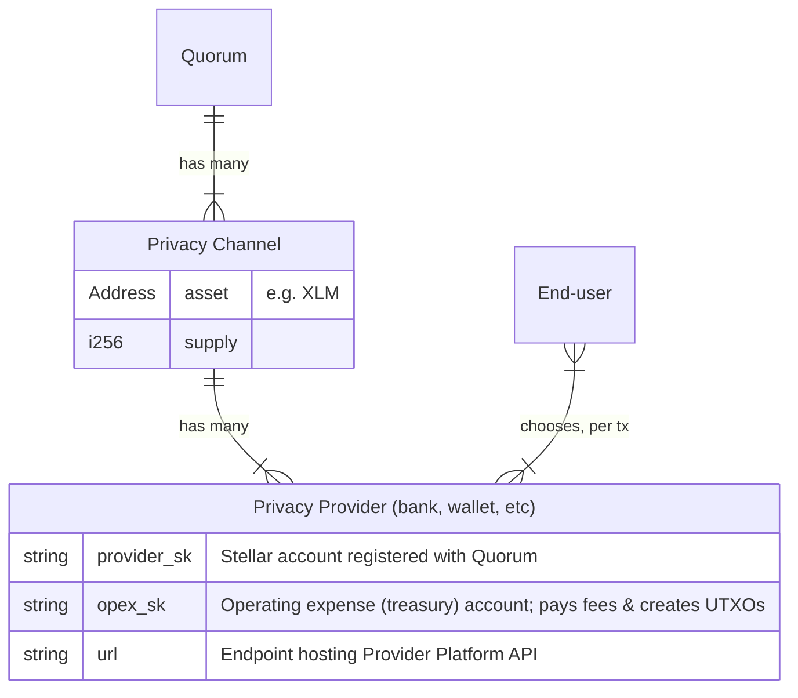

<p align=center>
  
</p>

<h1 align=center>Privacy Provider Platform</h1>

Moonlight: the missing privacy layer, for any blockchain, built on Stellar.

Privacy Providers are a key component of Moonlight, providing a flexible, regulatory-friendly 3rd party for user onboarding and transaction facilitation.



## Docker

The provider platform runs as two containers: PostgreSQL and the Deno app.

### Quick start

```bash
cp .env.example .env
# Fill in .env with your keys and contract IDs

docker compose up -d
```

This starts PostgreSQL and the provider app on port 3000.

### Running migrations

The Dockerfile supports an optional entrypoint script mounted at `/app/entrypoint.sh`. If present, it runs instead of the default `deno task serve`, allowing you to run migrations or other setup before starting.

```bash
ENTRYPOINT_SCRIPT=/path/to/your/entrypoint.sh docker compose up -d
```

Example entrypoint that runs migrations:

```bash
#!/bin/sh
set -e
deno task db:migrate
exec deno task serve
```

If no entrypoint is mounted, the app starts directly without migrations.

### DB only

To run just PostgreSQL (e.g. when running the app with Deno locally):

```bash
docker compose up -d db
```

Then run the app directly:

```bash
deno task db:migrate
deno task serve
```

## Run locally (without Docker)

Copy `.env.example` to `.env` and fill in the values. You will need:

- A local Stellar network: `stellar container start local`
- Deployed contracts from [soroban-core](https://github.com/Moonlight-Protocol/soroban-core)
- A provider account registered with the quorum contract
- A treasury (OpEx) account for fees

See the [local-dev](https://github.com/Moonlight-Protocol/local-dev) repo for automated setup.

```bash
docker compose up -d db
deno task db:migrate
deno task serve
```

## Deploy (to testnet)

Follow a similar process to local setup, replacing `local` with `testnet`.

To integrate with the existing testnet privacy channel maintained by the Moonlight team (see `fly.toml` for contract addresses), create `provider` and `treasury` accounts, then contact us to get your provider registered with our quorum contract.

We deploy to [fly.io](https://fly.io). The `fly.toml` file is provided as a minimal example.

To deploy to Fly.io: update `fly.toml` with your `OPEX_PUBLIC`, push to GitHub, then deploy from your Fly.io dashboard (branch: `dev`). Set these secrets:

- `PROVIDER_SK`: `stellar keys show provider`
- `OPEX_SECRET`: `stellar keys show treasury`
- `SERVICE_AUTH_SECRET`: generate with `node -e "console.log(btoa(String.fromCharCode(...crypto.getRandomValues(new Uint8Array(32)))))"`

After deploying, SSH in and run migrations:

```bash
fly console ssh -s
deno task db:migrate
```
