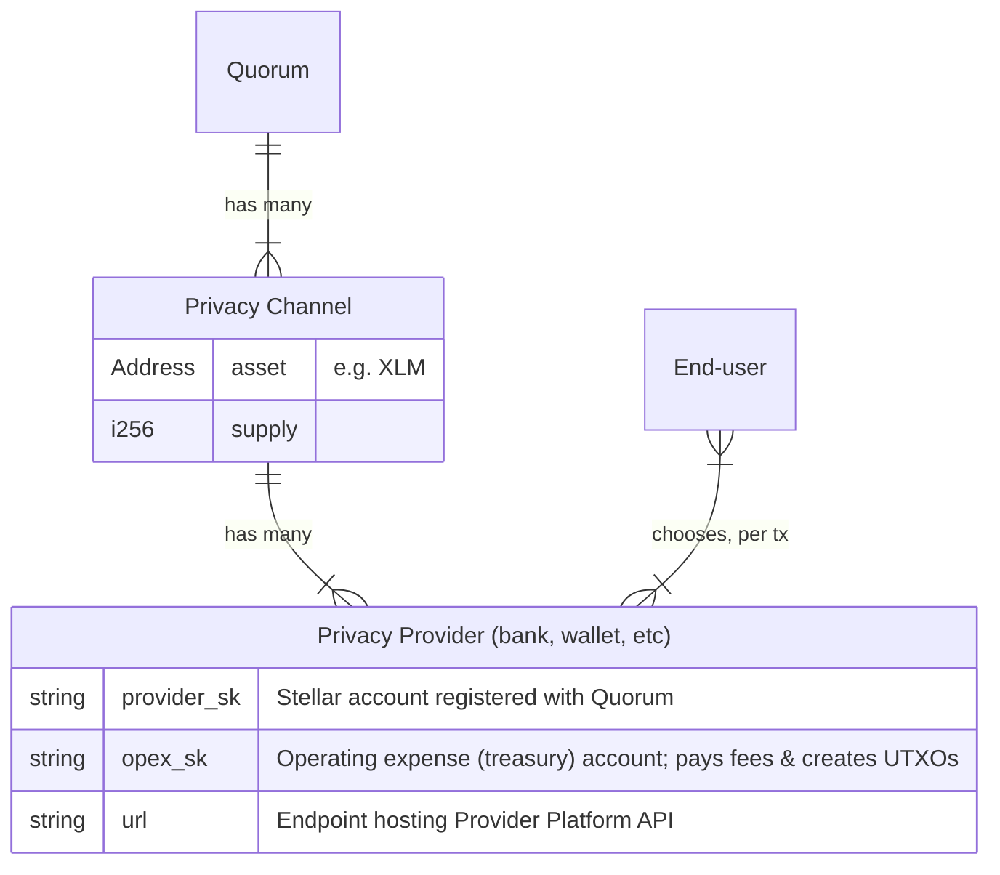

<p align=center>
  
</p>

<h1 align=center>Privacy Provider Platform</h1>

Moonlight: the missing privacy layer, for any blockchain, built on Stellar.

Privacy Providers are a key component of Moonlight, providing a flexible, regulatory-friendly 3rd party for user onboarding and transaction facilitation.



# Run Locally

This app comes with a `.env.example` with some missing values. Copy it to `.env`:

```bash
cp .env.example .env
```

Then, to fill it in, you will need to:

- Run [Docker Desktop](https://www.docker.com/products/docker-desktop/) or [an alternative](https://mattrickard.com/docker-desktop-alternatives)
- Run a local Stellar blockchain: `stellar container start local`
- Build and deploy [the Quorum & Privacy Channel contracts](https://github.com/Moonlight-Protocol/soroban-core) to your local network. Copy the addresses of these contracts into your `.env` for `CHANNEL_CONTRACT_ID` (the privacy channel) and `CHANNEL_AUTH_ID` (the quorum contract).
- Generate two stellar accounts:
  
  - A provider account:

    ```bash
    stellar keys generate provider --network local --fund
    ```

    Register this account with the quorum contract you deployed in the last step. You will need to do this as the admin account you configured while initializing that contract.

    ```bash
    stellar contract invoke \
      --network local \
      --id channel_auth_contract \
      --source admin \ # or whatever you called this key!
      --
      add_provider provider
    ```

    Then copy this account's secret key:

    ```bash
    stellar keys show provider
    ```

    Paste it into your `.env` file for the `PROVIDER_SK` value.

  
  - A treasury / Operating Expense (OpEx) account, responsible for holding and using funds to cover network fees and fuel ramping workflows with deposits/withdrawals facilitated by the provider:

    ```bash
    stellar keys generate treasury --network local --fund
    ```

    Copy its public key:

    ```bash
    stellar keys address treasury
    ```

    And paste it into your `.env` file for the `OPEX_PUBLIC` value.

    Copy its secret key:

    ```bash
    stellar keys show treasury
    ```

    And paste it into your `.env` file for the `OPEX_SECRET` value.

Now you can run this project with the [Docker Compose](https://docs.docker.com/compose/) CLI:

`docker-compose up -d`

This will initialize, migrate, & start a database, then start `deno task serve` to serve the Provider API on the port specified in `.env` (`8000` by default). You can check that you get a successful response from your local API by visiting:

```
http://localhost:8000/api/v1/stellar/auth?account=GAS567Y7AT2W3B32TMIPLD4WF3JWNFTAAJBZNCLIAGTIFJWEOOULCN35
```

# Deploy (to testnet)

If you want to test everything end-to-end, you can follow a similar process to the above, replacing `local` with `testnet`.

If you want to integrate with the existing testnet privacy channel & quorum contract maintained by the Moonlight team (see `fly.toml` file for contract addresses), you can create `provider` and `treasury` accounts using a similar workflow to the above, then message us to get your `provider` account registered with our quorum contract.

Then you'll need to deploy this service.

We maintain two providers, deployed to [fly.io](https://fly.io). For this reason, we already have a `fly.toml` file and a `fly.provider-b.toml` file in this repository. It will be the easiest for you to also deploy to Fly.io.

Note: these configs and instructions are provided AS MINIMAL EXAMPLES. The Moonlight team are NOT infrastructure experts, and we may have configured things suboptimally. Feel free to improve on our work, if you know better!

If you wish to deploy to Fly.io, update the `fly.toml` file with your `OPEX_PUBLIC`, being sure to commit your change and push it to GitHub. Then sign up for Fly.io. From your Fly.io dashboard, deploy from GitHub, selecting this project. Make sure you set the branch to `dev`. Set Environment Variables for your secrets:

  * `PROVIDER_SK`: the value given by `stellar keys show provider`
  * `OPEX_SECRET`: the value given by `stellar keys show treasury`
  * `SERVICE_AUTH_SECRET`: generate a value. You can use:

    ```bash
    node -e "console.log(btoa(String.fromCharCode(...crypto.getRandomValues(new Uint8Array(32)))))"
    ```

Once it's deployed, you will need to SSH into your app vm and initialize/migrate your database. You can do this with the Fly CLI]():

```bash
fly console ssh -s
```

This will let you pick one of your app VMs from a list. Look at your Fly dashboard and pick the one that is running your app. If you pick the right one, once you're SSHed in, you will be in the `/deno-dir` directory. Once there, run the migrations:

```bash
deno task migrate
```
